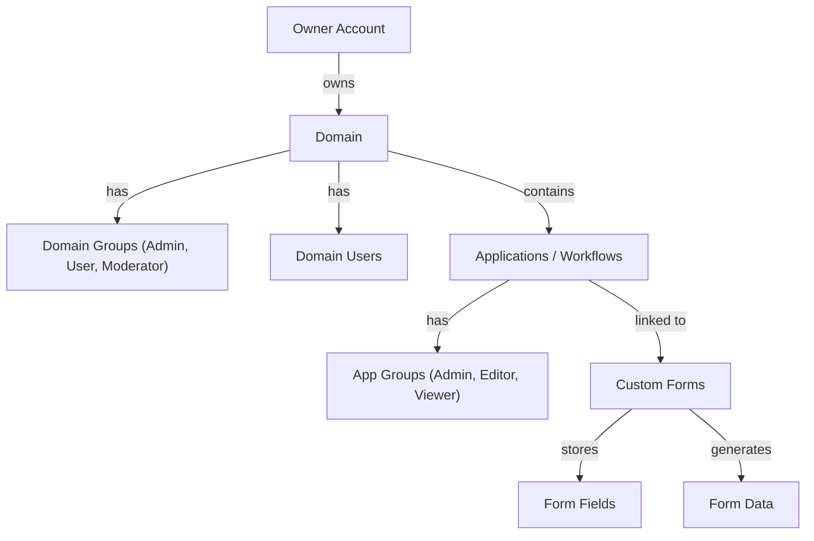
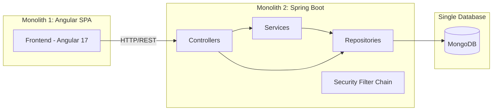

# Codebase Architecture Analysis — formGenarator-MrChand

## What Is This Project?

A **multi-tenant adaptive business process / form generator platform** built with:

| Layer | Tech | Version |
|---|---|---|
| Backend | Spring Boot + Spring Security + JWT | 3.3.1 |
| Database | MongoDB | 6.0 |
| Frontend | Angular (NgModule-based) | 17 |
| Auth | JWT tokens (cookie + sessionStorage + localStorage) | — |

### Core Domain Concepts



---

## Architecture Style: Monolithic (Two-Tier)

The project follows a **monolithic architecture** with a separately deployed Angular SPA frontend.



**Why monolithic:**
- Single deployable Spring Boot JAR with all controllers, services, and repositories
- Single shared MongoDB database (`app`) with all collections
- All business logic (auth, forms, domains, permissions) in one process
- No service-to-service communication, no message queues
- All 76 Java files in one `com.formgenerator` package

**This is the right choice** for the current project size (~76 Java files, small team). Microservices would add unnecessary operational overhead at this stage.

---

## Backend Structure (76 Java files)

| Layer | Count | Examples |
|---|---|---|
| Controllers | 11 | `DomainController`, `AuthController`, `CustomFormController`, `AppGroupController` |
| Services | 5 | `PermissionService`, `DomainProvisioningService`, `ApplicationProvisioningService` |
| Repositories | 16 | `DomainRepository`, `CustomFormRepository`, `AppGroupRepository`, etc. |
| Models | 15+ | `CustomForm`, `FormField`, `Domain`, `Application`, `AppGroup`, etc. |
| DTOs | 10 | `AuthResponse`, `DomainUserResponse`, `CreateApplicationRequest`, etc. |
| Security/Auth | 8 | `WebSecurityConfig`, `AuthTokenFilter`, `UserDetailsImpl`, etc. |
| Tests | 12 | Controller + service + security tests |

## Frontend Structure (45 TypeScript files)

| Category | Components |
|---|---|
| Auth/Domain | `login`, `owner-signup`, `domain-login`, `domain-signup`, `domain-create` |
| Domain Management | `domain-home` (332 lines), `domain-users`, `app-home` |
| Form System | `model-page`, `model-render`, `model-options`, `render-form`, `data` |
| Navigation | `navi-bar`, `navi-data`, `home-page`, `not-found-page` |
| Services | `auth.service`, `base.service`, `domain.service`, `httpinterceptor` |
| Guards | `AuthGuard`, `domain.guard` |

---

## 🔴 Critical Issues

1. **Credentials committed in `.env`** — MongoDB password, JWT secret, and SSL password exposed in repo
2. **Duplicate routing** — `RouterModule.forRoot()` called in both `app-routing.module.ts` and `app.module.ts`
3. **Redundant auth handling** — Token attached in both `BaseService` and `HttpInterceptor`

## 🟡 Moderate Issues

4. **Wrong npm deps** — `express`, `cors`, `http` in Angular frontend `package.json`
5. **Wildcard versions** — Angular deps using `"*"` makes builds non-reproducible
6. **God Component** — `domain-home.component.ts` at 332 lines handling 6+ responsibilities
7. **Missing service layer** — `CustomFormController` injects repositories directly
8. **Clutter files** — `SecondGitPushCodes.md`, `log` (325KB), `DOCKER_AUTHENTICATION_LOG.md`, `[Help`
9. **Token stored 3 ways** — Cookie, sessionStorage, and localStorage simultaneously

## 🟢 Strengths

| Aspect | Details |
|---|---|
| Permission system | Clean enum-based permission checking for domain and app levels |
| Multi-tenant design | Owner → Domain → App hierarchy with group-based RBAC |
| Test coverage | 12 backend tests covering controllers, services, and security |
| Security config | Stateless JWT, granular endpoint permissions, proper CSRF handling |
| Provisioning services | Auto-setup of default groups on domain/app creation |
| DTOs | Proper request/response separation from domain models |

---

## Recommended Action Plan

### Phase 1: Immediate Fixes (Security & Bugs)
1. Remove `.env` from git tracking, add to `.gitignore`, rotate all credentials
2. Fix duplicate `RouterModule.forRoot()` — consolidate into `AppRoutingModule`
3. Remove redundant auth handling — keep interceptor, simplify `BaseService`

### Phase 2: Clutter Removal
1. Delete `SecondGitPushCodes.md`, `log`, `DOCKER_AUTHENTICATION_LOG.md`, `[Help`
2. Remove `express`, `cors`, `http` from frontend `package.json`
3. Pin Angular dependency versions (replace `*` with `^17.3.9`)

### Phase 3: Refactoring
1. Extract `CustomFormService` (move logic from controller to service layer)
2. Break up `domain-home.component.ts` into focused sub-components
3. Consolidate token storage to one strategy
4. Move routing into `app-routing.module.ts`

### Phase 4: Future Considerations
1. Organize into a **Modular Monolith** with clear module boundaries:
   ```
   com.formgenerator/
   ├── platform/     ← Auth, security (partially done)
   ├── domain/       ← Domain management
   ├── forms/        ← Form builder
   ├── apps/         ← Application/workflow
   └── shared/       ← Shared DTOs, utils
   ```
2. Migrate to Angular **standalone components** (Angular 17 supports this)
3. Update `jjwt` from `0.9.1` to latest `0.12.x`
4. Implement proper environment-based configuration

---

**Verdict: No new architecture needed. Focused cleanup and refactoring will bring the codebase into great shape.**
