# AdaptiveBP — C4 Architecture Diagrams

> **Last updated:** 2026-02-25  
> **Notation:** [C4 Model](https://c4model.com/) rendered with Mermaid  
> **Scope:** Documents the **current** system as deployed, not aspirational targets

---

## Table of Contents

1. [Level 1 — System Context Diagram](#level-1--system-context-diagram)
2. [Level 2 — Container Diagram](#level-2--container-diagram)
3. [Level 3 — Component Diagram (Backend)](#level-3--component-diagram-backend)
4. [Level 3 — Component Diagram (Frontend)](#level-3--component-diagram-frontend)
5. [Level 4 — Code Diagram: Identity Module](#level-4--code-diagram-identity-module)
6. [Level 4 — Code Diagram: Organisation Module](#level-4--code-diagram-organisation-module)
7. [Level 4 — Code Diagram: App Management Module](#level-4--code-diagram-app-management-module)
8. [Level 4 — Code Diagram: Form Builder Module](#level-4--code-diagram-form-builder-module)
9. [Level 4 — Code Diagram: Security (shared)](#level-4--code-diagram-security-shared)
10. [Deployment Diagram](#deployment-diagram)

---

## Level 1 — System Context Diagram

*Who uses AdaptiveBP and what external systems does it interact with?*

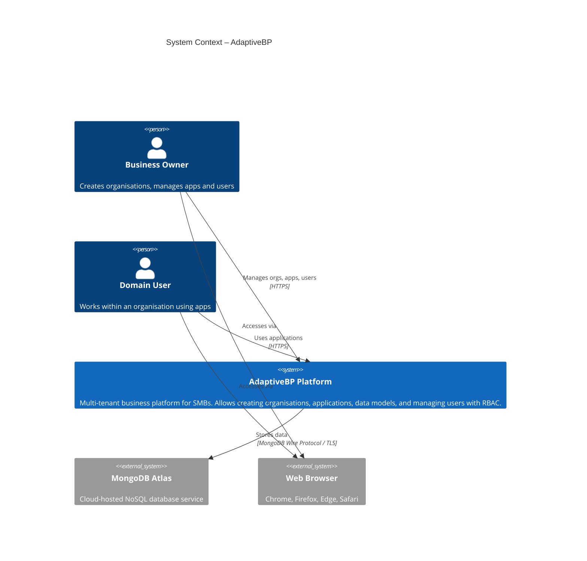

---

## Level 2 — Container Diagram

*What are the major deployable units that make up AdaptiveBP?*

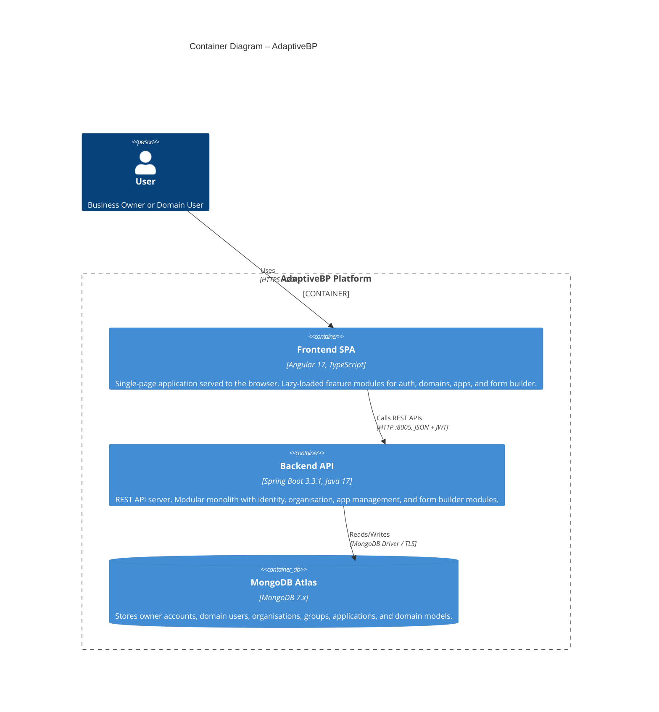

---

## Level 3 — Component Diagram (Backend)

*What modules and shared components make up the Spring Boot API?*

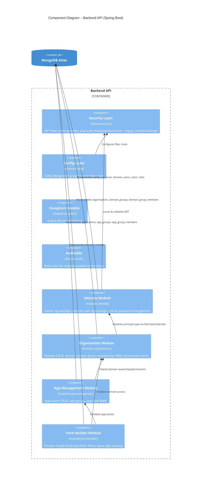

---

## Level 3 — Component Diagram (Frontend)

*What modules make up the Angular SPA?*

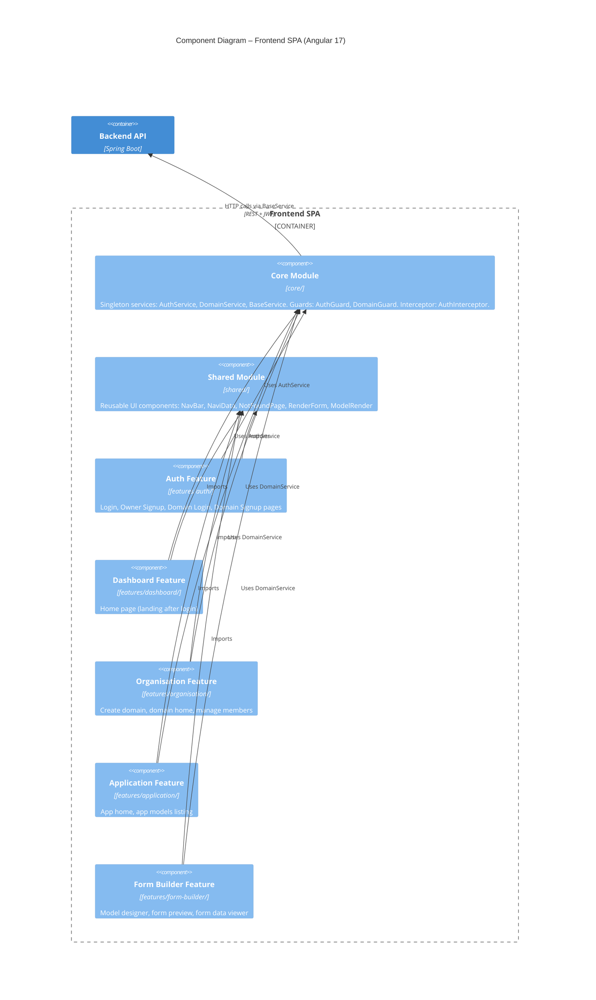

---

## Level 4 — Code Diagram: Identity Module

*Classes and relationships within the identity module.*

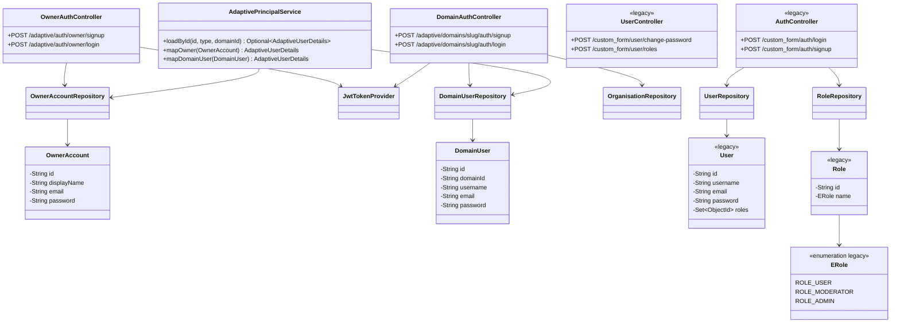

---

## Level 4 — Code Diagram: Organisation Module

*Classes and relationships within the organisation module.*

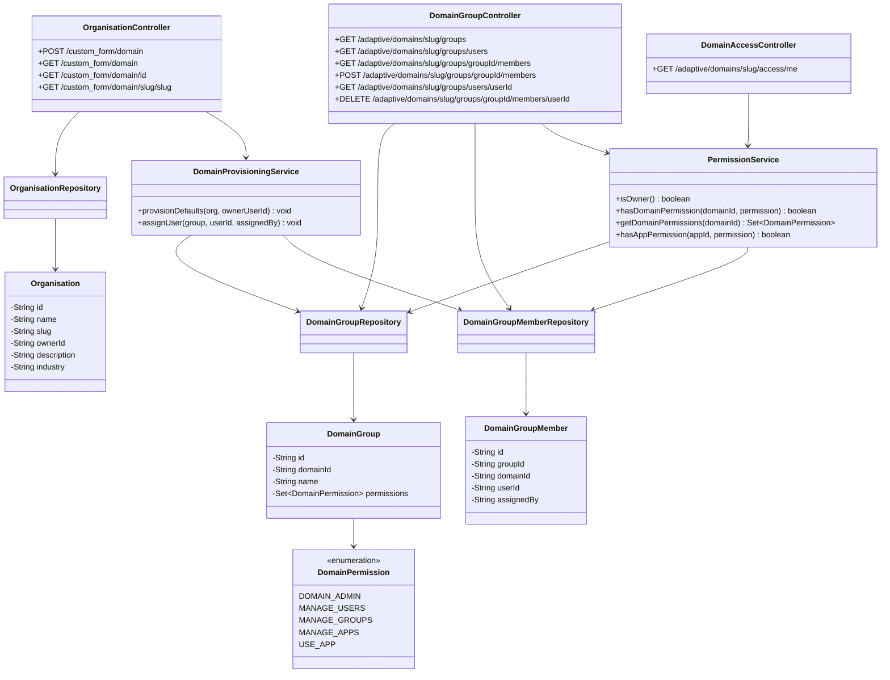

---

## Level 4 — Code Diagram: App Management Module

*Classes and relationships within the app management module.*

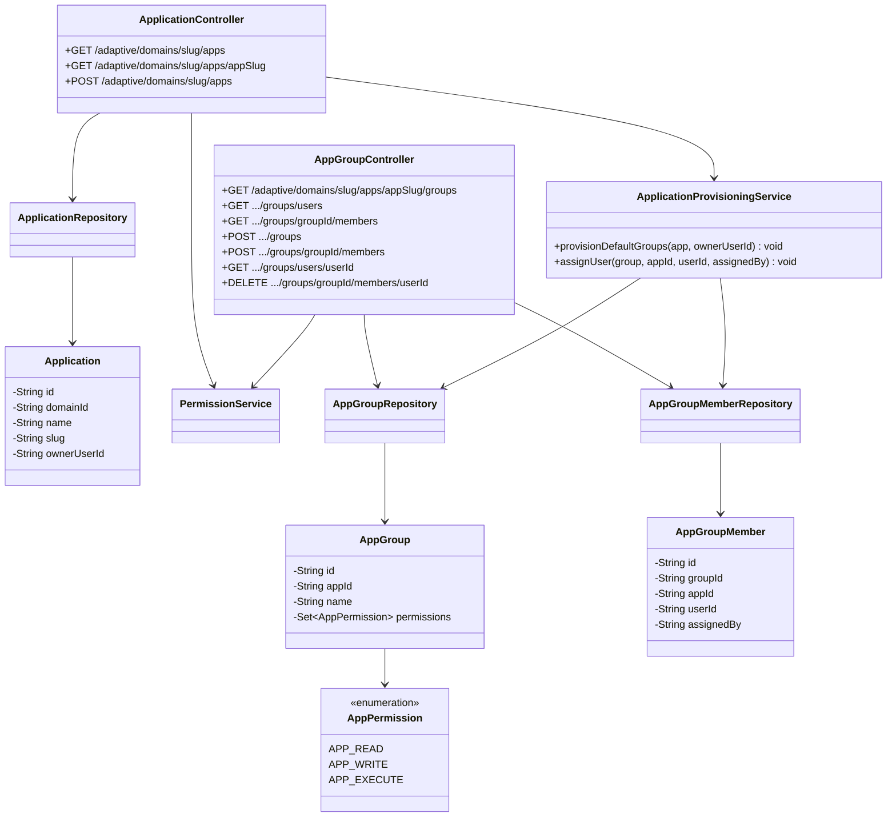

---

## Level 4 — Code Diagram: Form Builder Module

*Classes and relationships within the form builder module.*

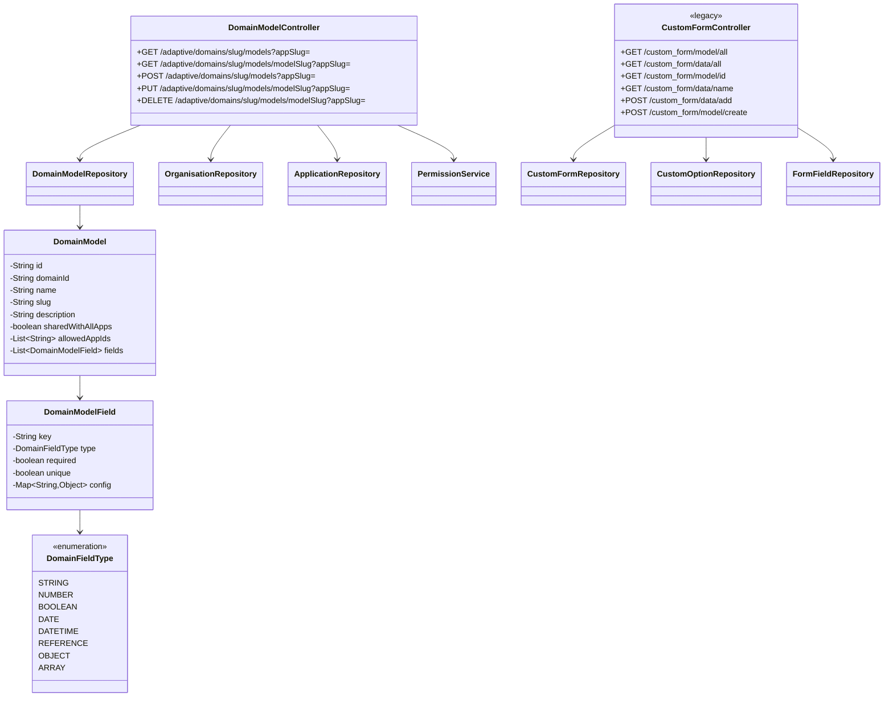

---

## Level 4 — Code Diagram: Security (shared)

*How authentication flows through the security layer.*

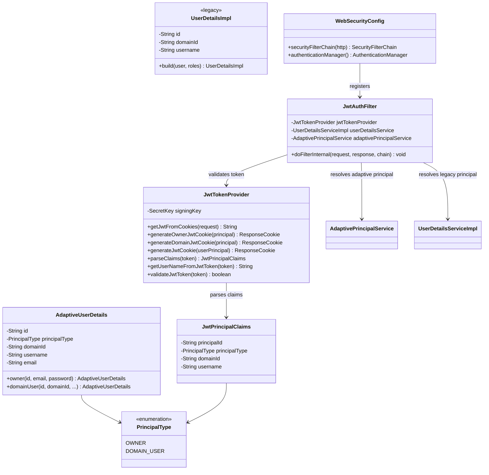

---

## Deployment Diagram

*Current development deployment topology.*

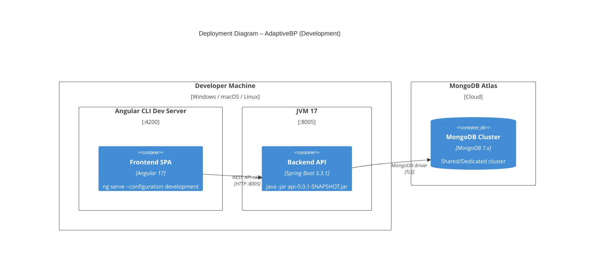

---

## API Request Flow (Sequence)

*Typical authenticated request lifecycle.*

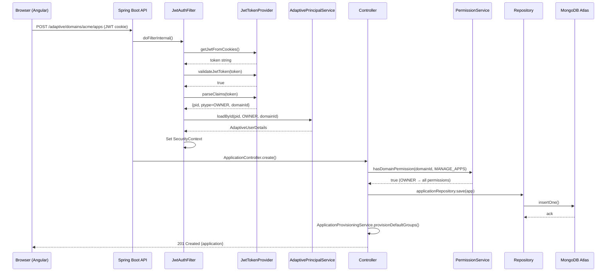

---

## Data Model (Entity Relationship)

*MongoDB collections and their logical relationships.*

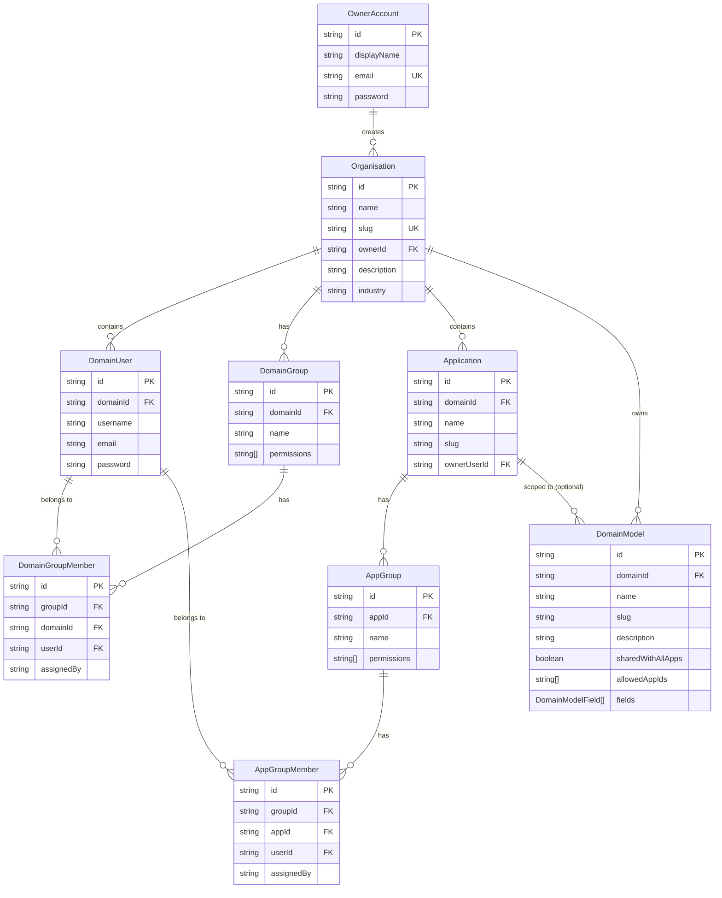
